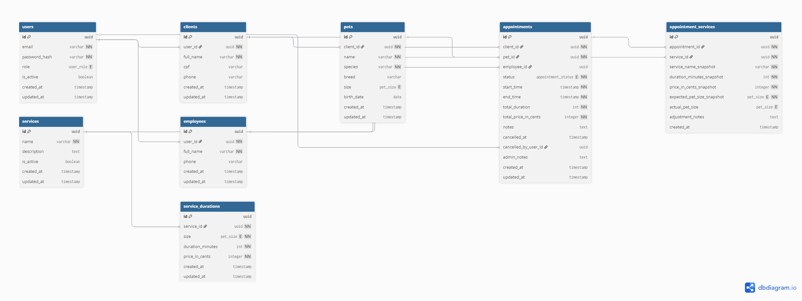

# 🐾 PetShop API

## 🚧 Status

Projeto em desenvolvimento.

---

API REST para gerenciamento de agendamentos, clientes, pets, serviços e funcionários de um PetShop.

O sistema permite:

- Cadastro de clientes e pets
- Gerenciamento de serviços
- Agendamento com múltiplos serviços
- Controle de funcionários
- Cálculo automático de duração e preço

---

## 🎯 Objetivo

Este projeto foi desenvolvido com foco em:

- Aplicação de boas práticas de arquitetura
- Separação de responsabilidades (SoC)
- Modelagem relacional consistente
- Uso de snapshot para integridade histórica
- Controle de status de agendamento

---

## 🚀 Tecnologias

- Node.js
- Express
- Prisma
- PostgreSQL
- TypeScript
- JWT
- Zod
- Bcrypt
- Logger

---

## 🗄️ Modelagem do Banco

A modelagem foi projetada para:

- Permitir múltiplos serviços por agendamento
- Congelar preço e duração no momento da criação (snapshot)
- Evitar duplicidade de duração por porte
- Manter integridade referencial



---

## 🏗️ Arquitetura da Aplicação

O projeto segue organização por domínio (feature-based):

```text
src/
 ├── modules/
 ├── shared/
 ├── lib/
 ├── app.ts
 └── server.ts
```

- modules → regras de negócio organizadas por domínio
- shared → middlewares e utilidades globais
- lib → integrações externas (Prisma, Logger)

---

## 📚 Documentação

- [Diagrama ER (editável)](./docs/database/er-diagram.drawio)
- [Arquitetura da Aplicação](./docs/architecture.md)
- [Regras de Negócio](./docs/business-rules.md)
- [Fluxos operacionais](./docs/system-flows.md)
- [API Endpoints](./docs/api-endpoints.md)
- [Validation Schemas](./docs/validation-schemas.md)
- [Autenticação e RBAC](./docs/authentication-and-rbac.md)

---
